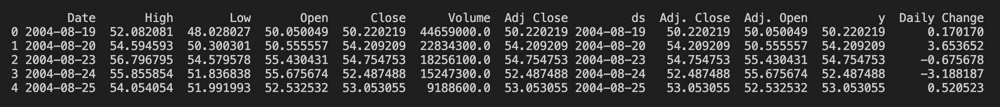
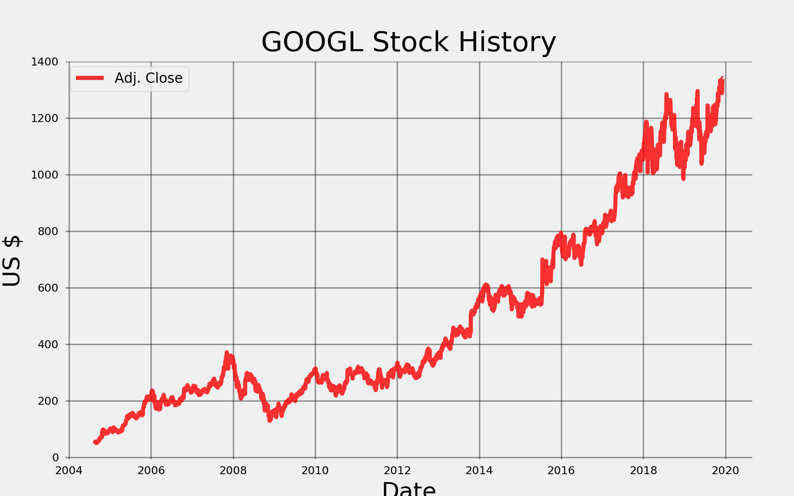
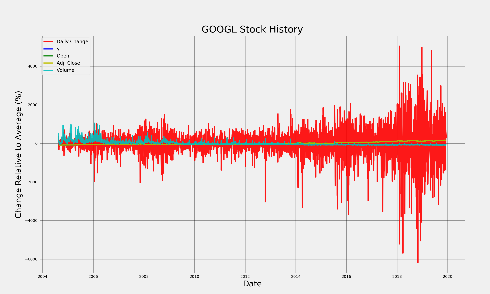
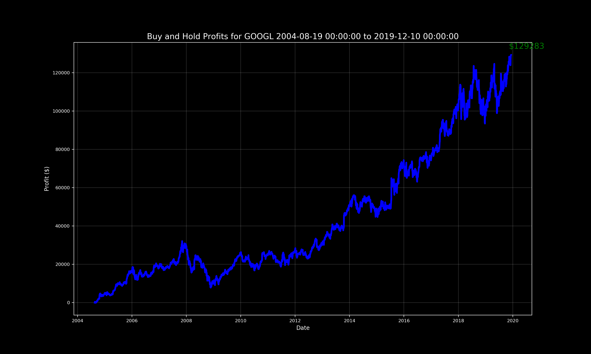
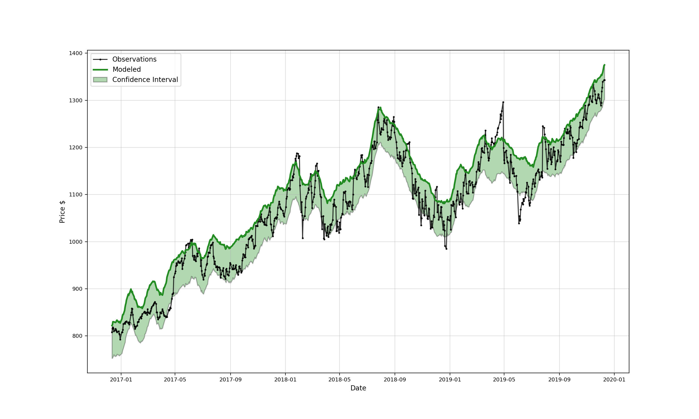
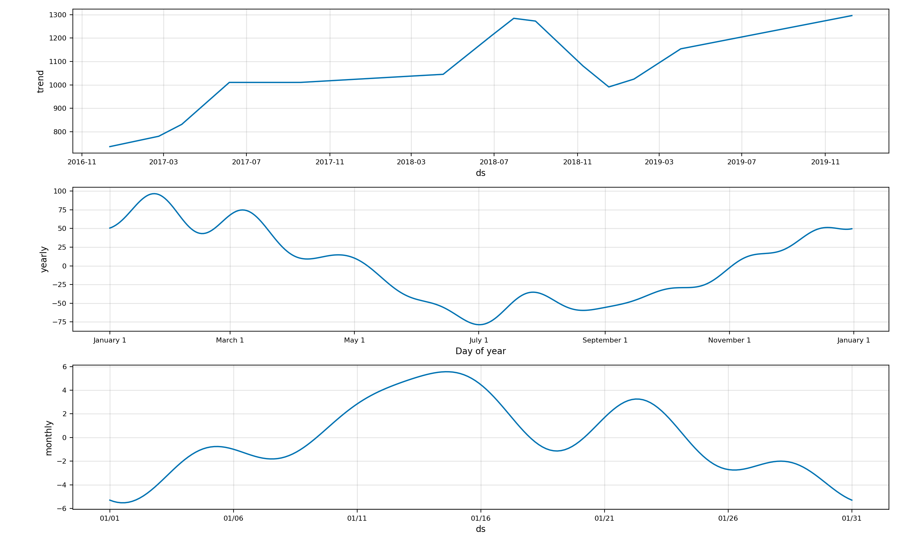
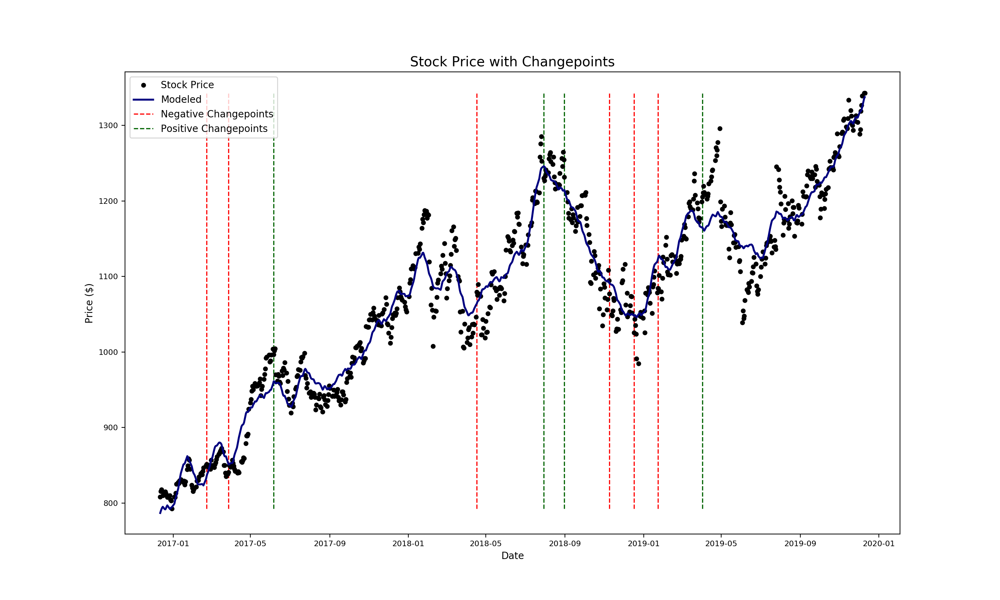
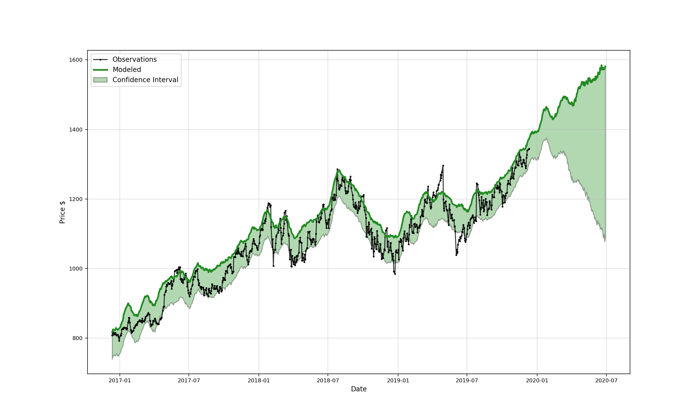

# Stock Data Analysis

This project presents a detailed stock data analysis. The analysis provides detailed comparison of stock price over time, search frequency of a keyword, and any negative or positive stock price changes that may have occured.

The entire source code of this project can be found on Github at http://www.github.com/rajatk16/stockreader

The repository contains two files: StockReader.py and test.py. The first file contains the actual code of the project, and the second file contains some simple tutorial code to help you get started.

---

## Getting Started

The StockReader.py contains a class called StockReader. On initialization, this class will use the **Pandas Datareader** package to fetch the stock prices. All we need to do is provide a stock's `ticker` symbol, and an optional `start_date` and `end_date`.

Here, I have fetched the stock price of Google using the Ticker **GOOGL**. If no `start_date` and `end_date` is given, then the code will fetch date from the year 2000 to the latest available date

```python
google = StockReader("GOOGL")
stock_history = google.stock
print(stock_history.head())
```

Once the data is fetched, we calculated the Adjusted closing and opening price of the stock (`Adj. Close` and `Adj. Open`), and take their difference as the `Daily Change`. The overall dataframe would look like this:



---

## Plotting Stock Prices

The StockReader class also contains a method called `plot_stock()` that can plot the stock prices of that particular stock. This method also prints the maximum, minimum and latest Closing Prices of the stock as shown below:

```python
google.plot_stock()
```

#### Output:

```console
Maximum Adj. Close = 1342.99 on 2019-12-09 00:00:00.
Minimum Adj. Close = 50.06 on 2004-09-03 00:00:00.
Current Adj. Close = 1342.89 on 2019-12-10 00:00:00.
```



The `plot_stock()` method can also be used to plot multiple columns of the dataframe like this:

```python
google.plot_stock(
  start_date='2004-08-19',
  end_date='2019-12-10',
  stats=[
    'Daily Change',
    'y',
    'Open',
    'Adj. Close',
    'Volume'
  ],
  plot_type='pct'
)

```

#### Output:



---

## Buy n Hold

Next, the stockreader and also tell you what your return would be if you bought some amount of the stock and held it, using the `buy_and_hold` method. Let's what would happen if we bought a 100 shares of Google and held it from 2004 till 2019

```python
google.buy_and_hold(
  start_date='2004-08-19',
  end_date='2019-12-10',
  nshares=100
)
```

#### Output:

```console
GOOGL Total buy and hold profit from 2004-08-19 00:00:00 to 2019-12-10 00:00:00 for 100 shares = $129284.00
```



---

## Additive Modelling

Additive modelling can be used to analyze and predict time series.

In such models, we represent a time series as a combination of patterns on different time scales and an overall trend.

From the above graphical representations, we can see that Google Stock price is continuously increasing with time. What we do not know is when these changes in stock prices are happening and what is causing them.

To answer such questions, I am using a library called Prophet, created by the Facebook team.

As with any other modelling, we first need to create the model as shown below:

```python
model, model_data = google.create_prophet_model()
```

When this code is run, we get the following plot:



The additive model built here will try smooth out the noise in the data. The model will also calculate uncertainty.

The `create_prophet_model()` will return two things: `model` and `model_data`. We can now use these things to plot the time series components as shown below:

```python
import matplotlib.pyplot as plt
model.plot_components(model_data)
plt.show()
```

#### Output:



From this plot, we can clearly see that the prices of the stock drop down in July and are at their highest during January/February. We can also see that the price rise during the middle of the month, and then fall down again by the end of it.

If you want to analyze the weekly trend of the stock, then we can do by:

```python
google.weekly_seasonality = True
model, model_data = google.create_prophet_model()
model.plot_components(model_data)
plt.show()
```

---

## ChangePoints

To find out when stock price is about to rise of fall, we can use the `changepoint_date_analysis` methods as shown below:

```python
google.changepoint_date_analysis()
```

#### Output:



The changepoints tend to line up with peaks and valleys in the stock price. Prophet only finds changepoints in the first 80% of the data, but nonetheless, these results are useful because we can attempt to correlate them with real-world events.

Google has a Search Trends tool which allows us to see the popularity of any search term over time in Google searches.

Our code can automatically retrieve this data for any search term we specify and plot the result on the original data. by modifying the previous method call as shown below:

```python
google.changepoint_date_analysis(search='gmail')
```

#### Note

The code is not working due to an imperfect update to the `PyTrends` library.

---

## Predictions

The Stockreader code can also forecast/predict future stock prices. All we need to do is call the `create_prophet_model` method and pass it the numbero of days that you want the model to predict the stock prices for.

```python
model, future = google.create_prophet_model(days=200)
```

Output:

```
Predicted Price on 2020-06-28 00:00:00 = $1341.47
```


